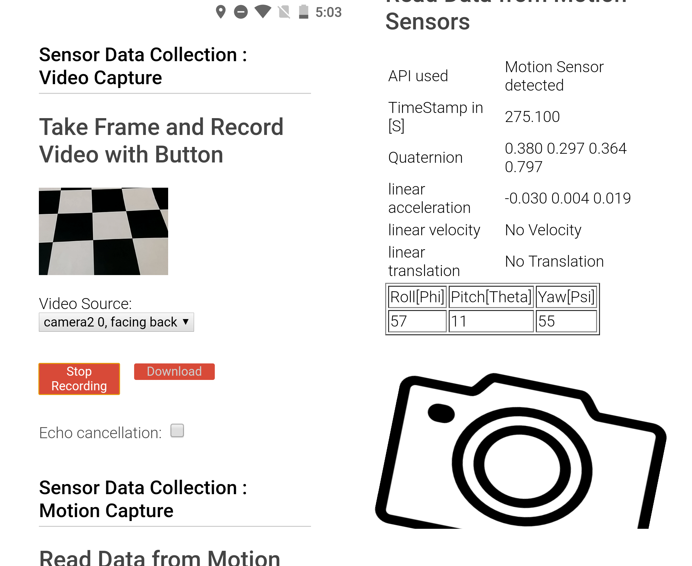
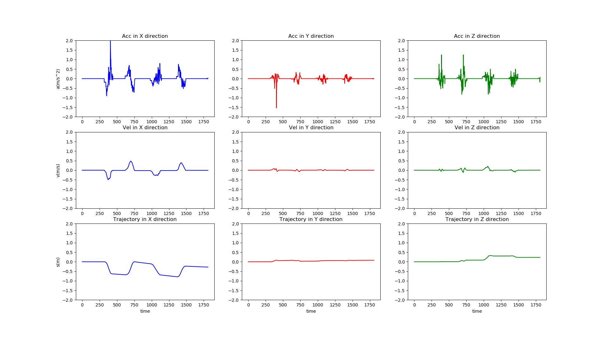

# Data_Collection
This is a Web-App based on new properties of HTML5, which could read camera frame and sensor data through embeded APIs in browsers on a terminal.
## How to use
People can open this webpage with mobile phone or tablet, which devices that support motion sensors. After reading the data from senors and camera, the users could download these data as .webm and .txt files for further analysis. 

#### please be aware that this Web-App only fit for Android Users.

### link: https://tianlunhu.github.io/DataCollection/
### Web interface demo:

## Data Processing
With IMU data from inersial sonser in moblie devices, veolocity, orientation and even motion trajactory could be recoverd from raw data.
here is an example "trajectory.py" which could recover the simple motion with collected data.

